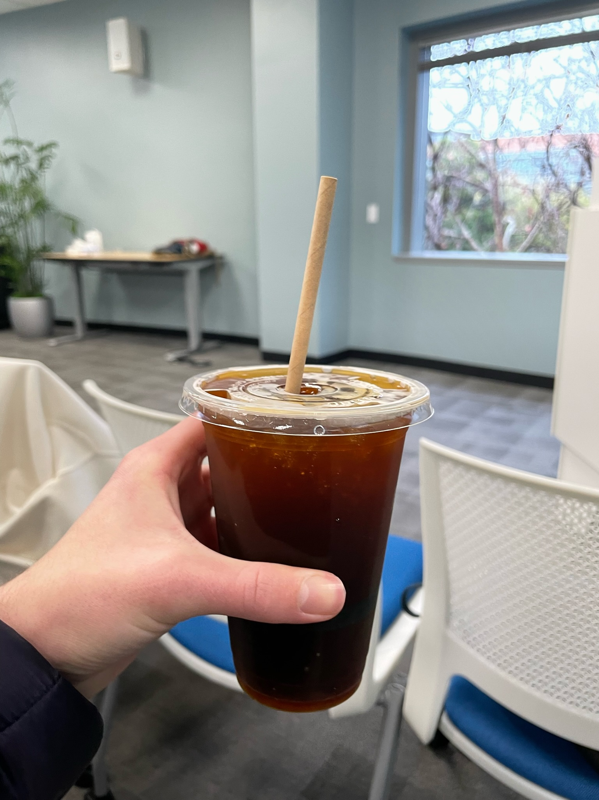

# Snippets

Specific Technologies is where I store snippets of code or tips that I forget easily or just find interesting for some reason.

Coding Interview Prep is what it sounds like... I need to grind some DS + Algs before the hiring season begins. I'm largely going off of [this repo here](https://github.com/P1xt/google-interview-university/blob/master/README.md) because, shocker, I too would like to work at Google and enjoy the delicious free coffee haha.

## Goal:

